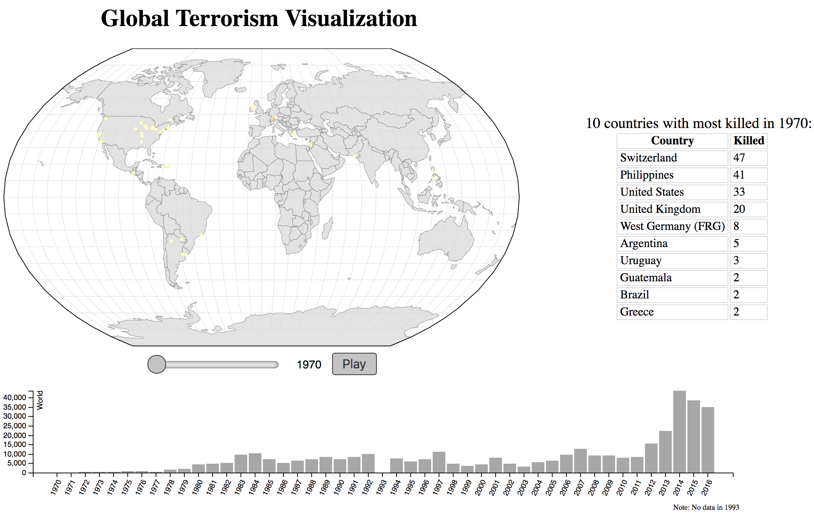

# Global Terrorism Visualization
Global Terrorism Visualization using D3.js

[GTD is a database](https://www.start.umd.edu/gtd/) of incidents of terrorism from 1970 to 2016 (with an incomplete data of 1993 due to issues with that year) which maintained by the University of Maryland. This visualization is for user centric, which means it tries to engage the user and convey insight to the audience, and it features three technical elements which are multiple coordinated views, animated view and interactive manipulation of the view.
## Introductions of the Design

There are three main views in my visualizations, the world map with incidents circles on the left, the top ten table on the right and the bar chart on the bottom.

A detailed description of the project can be found in the [PDF file here](JiongxuHou-17304249-Assignment4-DataVisualization.pdf).
